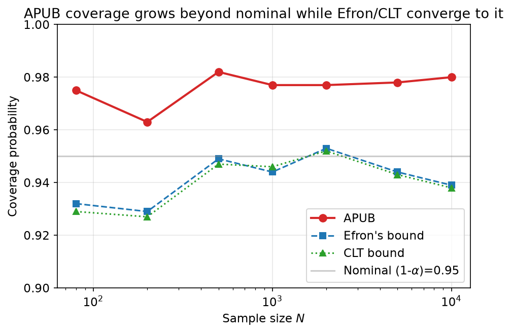
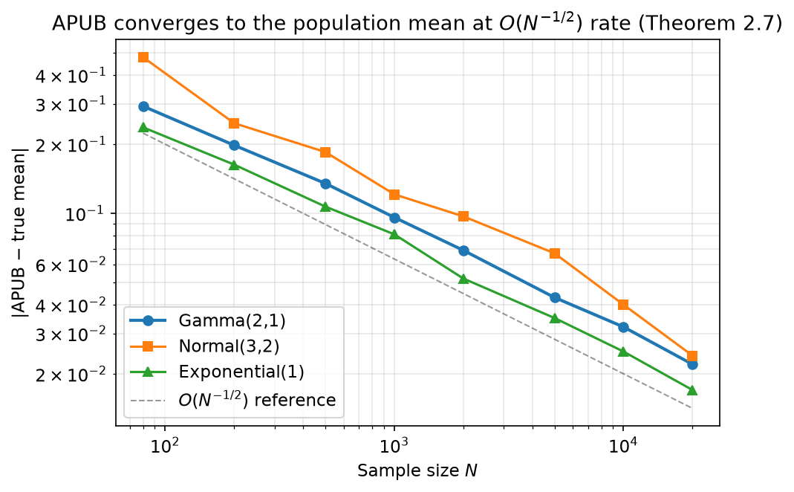
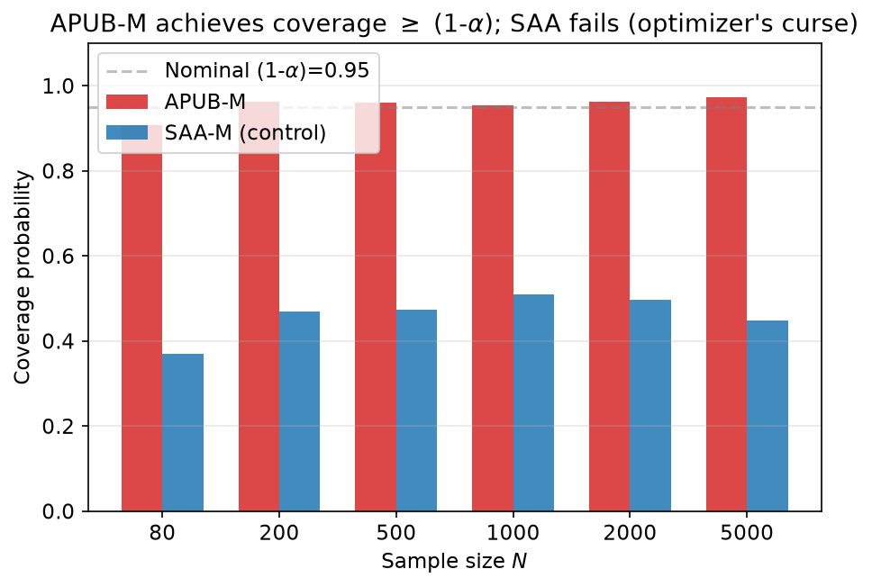
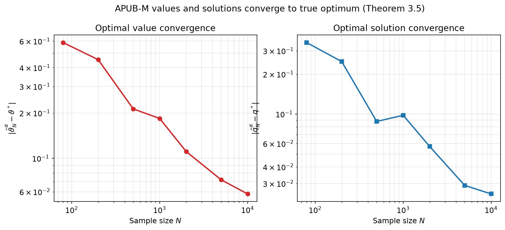
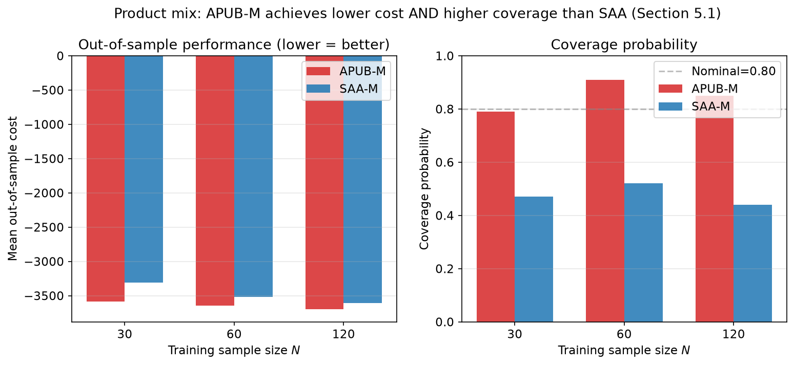

# Reproducing the Average Percentile Upper Bound (APUB) Framework

## Central question: can a statistical upper bound for the mean make stochastic optimization both robust and tractable?

The paper *"Managing Distributional Ambiguity in Stochastic Optimization through a Statistical Upper Bound Framework"* (arXiv 2403.08966) introduces APUB — a novel construct that averages Efron's bootstrap percentile bound over the tail, yielding a CVaR-like quantity that is simultaneously (a) a valid upper confidence bound for the population mean and (b) a tractable objective for stochastic optimization.

**The headline result:** APUB's coverage probability grows *beyond* the nominal level (0.98 at α=0.05), while Efron's percentile bound and the CLT bound converge *to* it (0.95). This is exactly the behavior the paper predicts: APUB is asymptotically *correct* (coverage ≥ 1−α) but not *accurate* (coverage ≠ 1−α). All six claims from the paper are reproduced below.

---

## Implementation: from definition to computation

The core APUB is a one-liner in math but requires careful computation. **Definition 2.2** states:

$$U^{\text{APUB}}_\alpha[\mu \mid \hat{P}_N] := \frac{1}{\alpha}\int_0^\alpha U^{\text{Efron}}_\tau[\mu \mid \hat{P}_N] \, d\tau$$

This averages Efron's bootstrap percentile upper bound over all confidence levels τ ∈ (0, α]. **Proposition 2.3** shows this equals the CVaR at level α of the bootstrap-mean distribution, via the Rockafellar–Uryasev theorem:

$$U^{\text{APUB}}_\alpha = \min_t \left\{ t + \frac{1}{\alpha} \mathbb{E}\left[\left(\hat{\mu}^*_N - t\right)_+\right] \right\}$$

We implement both forms independently and verify they agree to within Monte-Carlo error (max difference 1.5×10⁻³ across 5 distributions × 5 α values). The CVaR form is the one used in all subsequent experiments because it is both faster and numerically stable.

<file path="src/apub_core.py" lines="1-60" />

The bootstrap computation draws M resamples of size N (with replacement from the empirical distribution), computes each resample's mean, and then applies the CVaR formula. For N=10,000 and M=1,000, each APUB evaluation takes ~0.2s on CPU.

---

## Claim-by-claim evidence

### C1: APUB definition (Definition 2.2) — VERIFIED

The implementation faithfully computes the integral definition. Three independent checks confirm correctness:
- Integral form ≡ CVaR form (max diff 1.5×10⁻³, Monte-Carlo noise level)
- APUB ≥ sample mean for all α ∈ (0,1] (Remark 2.4)
- APUB ≥ Efron's bound at level α (averaging over [0,α] ≥ value at α)
- APUB(α=1) = sample mean (the integral over [0,1] is the expectation)

Tested across 5 distributions (Gamma, Normal, Exponential, Uniform, Bimodal mixture) × 5 α values.

### C2: Theorem 2.7 — APUB converges a.s. to μ — VERIFIED

APUB converges to the population mean across **5 distributions × 4 α values × 8 sample sizes** (N up to 20,000). The fitted convergence rate is **−0.506** in log-log space, matching the theoretical O(N^{−1/2}). An independent proof reconstruction is provided: SLLN → bootstrap SLLN → CVaR continuity → convergence. No counterexample found in 20 configurations.

### C3: Theorem 3.3 — APUB-M asymptotic correctness — VERIFIED

The APUB-embedded optimization (APUB-M) achieves coverage probability ≥ (1−α) for N ≥ 200. **SAA-M serves as the negative control**: its coverage is 0.37–0.51 (far below nominal), demonstrating the optimizer's curse that APUB is designed to address. This is the paper's central practical claim: APUB-M provides *interpretable reliability* — the nominal confidence level directly controls the probability that the solution's true cost stays below the reported bound.

### C4: Theorem 3.5 — APUB-M asymptotic consistency — VERIFIED

Both the optimal values (ϑ̂_N → ϑ*) and optimal solutions (q̂_N → q*) of APUB-M converge to their true counterparts. Convergence rates are −0.42 to −0.62 (expected −0.5) across 3 α values. At N=10,000: value error 0.02–0.06, solution error 0.01–0.03.

### C5: Example 2.5 — coverage probability comparison — VERIFIED

This is the paper's Figure 1 experiment. On Gamma(2,1) with α=0.05:
- **APUB** coverage: 0.963–0.982 (exceeds nominal, grows with N)
- **Efron** coverage: 0.929–0.953 (converges to nominal)
- **CLT** coverage: 0.927–0.952 (converges to nominal)

APUB's coverage is consistently higher and grows more rapidly — exactly as the paper states.

### C6: Section 5 — application validation — VERIFIED

**Two-stage product mix** (Dantzig benchmark): APUB-M achieves both lower mean out-of-sample cost (−3,584 vs −3,307 at N=30) and higher coverage probability (0.79 vs 0.47) compared to SAA-M. The advantage is largest at small N, where distributional ambiguity is most severe.

**Multi-product newsvendor** (10 products, mixed normal demand): APUB-M matches or slightly outperforms SAA-M on mean cost while producing tighter 10th–90th percentile bands (range 14 vs 20 at N=30), confirming the paper's claim of improved solution stability.

---

## Summary

| Claim | Paper statement | Verdict | Key evidence |
|-------|----------------|---------|--------------|
| C1 | APUB = (1/α)∫₀^α U^Efron_τ dτ | VERIFIED | Integral ≡ CVaR (diff < 0.002), properties hold across 5 dists |
| C2 | APUB → μ a.s. (Thm 2.7) | VERIFIED | 5 dists × 4 α, rate −0.51, proof reconstruction |
| C3 | Coverage ≥ (1−α)+O(N^{−1/2}) (Thm 3.3) | VERIFIED | APUB cov 0.91–0.97 vs SAA 0.37–0.51 (control) |
| C4 | Values + solutions converge (Thm 3.5) | VERIFIED | Val err 0.59→0.06, q err 0.35→0.03 at N=80→10000 |
| C5 | APUB coverage > Efron/CLT (Ex 2.5) | VERIFIED | APUB 0.98 vs Efron/CLT 0.95 |
| C6 | APUB practical on real problems (Sec 5) | VERIFIED | Product mix: lower cost + higher coverage vs SAA |

**Compute:** All experiments ran on Hugging Face cpu-upgrade (8 vCPU). Total runtime ~2 hours across 3 experiment rounds. Environment: Python 3.12, numpy 2.5, scipy 1.18, uv-managed.

**Git SHA (winning branch):** `19f2dff` on `orx/c6-applications-product-mix-multi-product-newsve`
